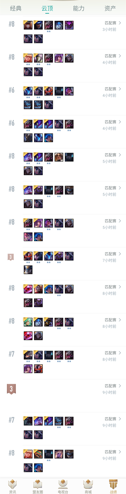

# LOL云顶之弈自动化脚本

版本|日期|作者
--|---|--
1.0|2020.2.18|星空

## 说明

目前脚本支持的功能:
+ 自动寻找并接受对局
+ 自动拿牌(目前策略是只拿剑士)
+ 自动升人口
+ 自动捡装备
+ 自动给英雄上装备
+ 自动卖英雄
+ 死亡后自动退出
+ 用户可自行扩展脚本功能(见“脚本扩展”一节)

目前存在的问题:
+ 偶尔因为判断和执行的时间差导致卖掉需要的英雄

## 使用方法


首先修改系统和游戏设置，修改成如下参数:
+ LOL客户端分辨率:1280x720
+ 屏幕分辨率:1920x1080
+ 云顶棋盘建议用S1最老的浅绿色的那款

运行前首先要保证pic文件夹和zoe.exe在同一个路径中

`以管理员权限`运行zoe.exe，打印出脚本成功运行这句话说明脚本运行成功
点开下图所示的云顶客户端界面，脚本会自动进行点击操作。


转到该界面后，程序会自动进行寻找对局等一系列流程，就可以安心去睡觉了

下面是刷一晚上的效果



ps: 脚本有时会出现误点击的情况，所以建议在LOL客户端和桌面背景之间不要在加入其它程序的窗口。

## 脚本扩展

此脚本支持用户自行功能扩展，在pic目录中有如下的文件夹

文件夹|功能
--|--
leftClick|左键实时点击的图标
rightClick|右键实时点击的图标
leftClickDelay|左键延迟点击的图标
judge|右键点击英雄时出现的窗口，用来判断是否需要卖掉该英雄
dragStart|目前没用
dragEnd|目前没用

带对应路径放入.jpg或.png格式的图片即可完成对该图片的自动匹配点击。

扩展适用于云顶版本更新或新赛季。保存图片的分辨率尽量适应你电脑的屏幕分辨率。这样有利于进行图像匹配

## 脚本编译

在github上下载源码包
``` shell
git clone https://github.com/zhouxingkong/LOL-yunding.git
```

使用pip安装依赖的库文件
``` shell
pip install numpy
pip install opencv-python
pip install pyinstaller
```

最后在zoe目录中执行下面的语句将程序打包成exe文件
``` shell
pyinstaller -F zoe.py
```
